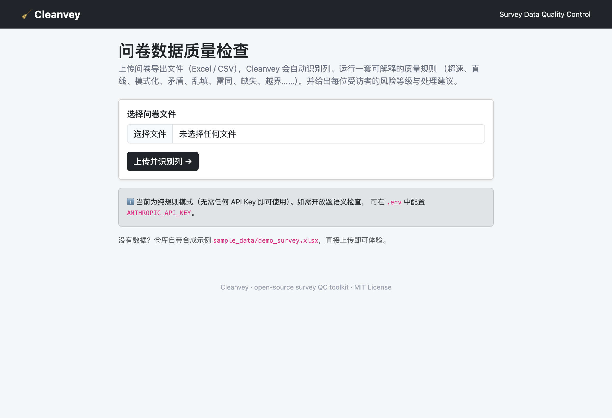
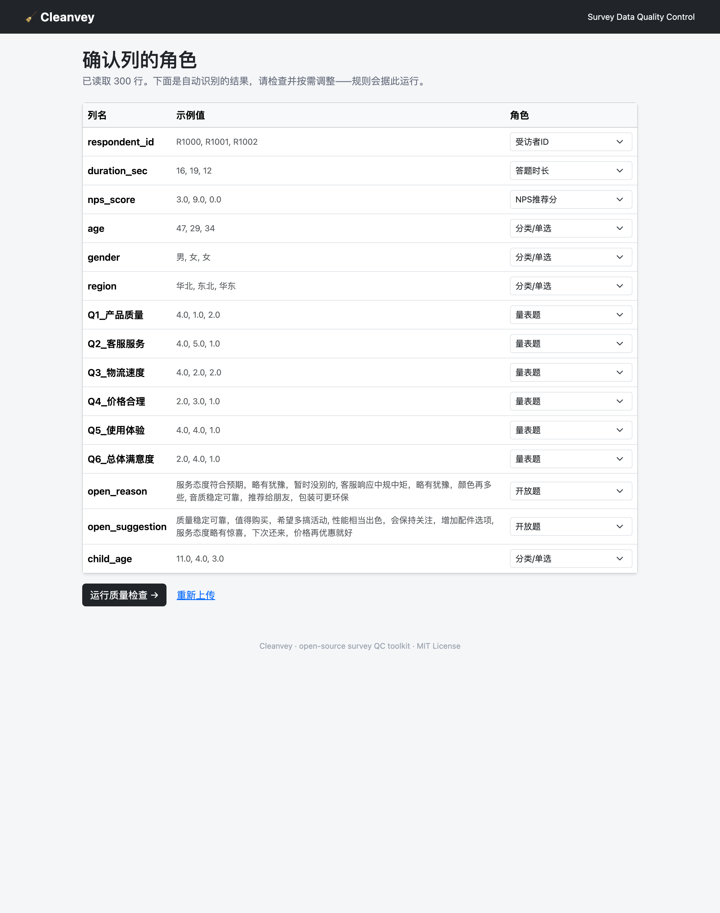
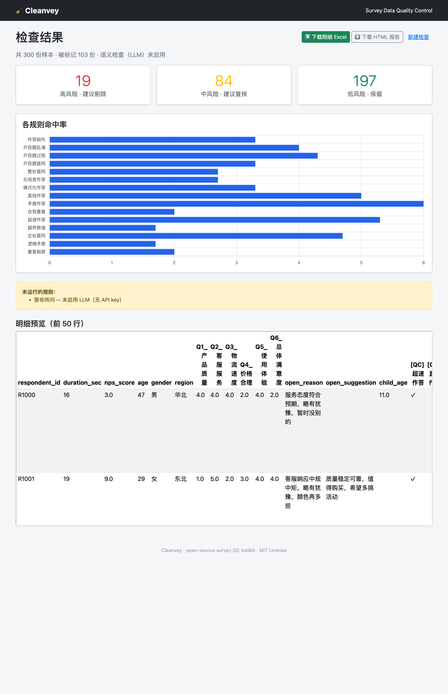

# 🧹 Cleanvey

[](https://github.com/frankglendon/cleanvey/actions/workflows/ci.yml)
[](LICENSE)
[](https://www.python.org/)

> **Catch the junk in survey data before it skews your numbers.**
> **在脏数据拉偏结论之前，先把它揪出来。**

Upload a survey export → Cleanvey runs **15 transparent quality checks** and
returns a per-respondent **risk score with a plain-language reason for every
flag**. Seconds instead of hours, consistent instead of gut-feel, auditable
instead of a black box. Works fully offline; an optional AI layer adds semantic
checks when you want them.

> 上传问卷导出文件 → Cleanvey 跑 **15 条透明的质量规则**，给出每位受访者的
> **风险分，并为每个标记附上一句大白话理由**。几秒钟而非几小时、统一标准而非凭感觉、
> 可审计而非黑箱。纯离线即可运行；需要时再开启可选的 AI 语义检查。

---

## 💡 Why it matters / 为什么重要

A meaningful slice of raw survey responses is low quality — bots, speeders,
copy-paste boilerplate, careless straight-lining, contradictory answers. Ship
them into the analysis and **every downstream number (NPS, satisfaction,
segmentation) is quietly wrong** — and so are the client decisions built on top.

Today that cleanup is **manual**: analysts eyeball thousands of open-ends and
scale grids by hand. It's slow, inconsistent between people, and hard to defend
when a client asks *"why did you drop these respondents?"*

**Cleanvey turns that into a repeatable, explainable pass:** every flagged
respondent comes with the exact rule and reason, ready to show a client.

> 问卷原始数据里总有一部分是脏的——机器人、超速作答、复制粘贴的套话、敷衍的直线作答、
> 自相矛盾的回答。混进分析，就会**悄悄拉偏 NPS、满意度、人群细分等每一个核心数字**，
> 连带影响建立在这些数字之上的客户决策。
>
> 而现在的清洗多半靠**人工**：分析师肉眼逐条看成千上万条开放题和量表。慢、因人而异，
> 客户一问“你凭什么剔除这些样本”时还很难解释清楚。
>
> **Cleanvey 把它变成一个可复现、可解释的步骤：** 每个被标记的样本都附上命中的规则和理由，
> 可以直接拿给客户看。

---

## 📸 See it / 界面预览

| 上传 Upload | 自动识别列 Auto column mapping |
|:---:|:---:|
|  |  |

**结果与风险报告 / Result & risk report**



---

## 🎯 What this project demonstrates / 这个项目体现了什么

- **Spotting a real, costly problem — and automating it.** Data quality directly
  determines whether a research deliverable is valid. I took a painful manual
  process and made it fast, consistent, and defensible.
  **发现真实且昂贵的业务痛点，并把它自动化。** 数据质量直接决定研究交付是否站得住脚——
  我把一个痛苦的人工流程，做成了快速、一致、可向客户交代的自动化方案。

- **Domain expertise, codified.** 15 named, transparent checks plus a
  configurable logic-constraint engine — the actual methodology of survey QC,
  written down so anyone can audit it.
  **把领域经验沉淀成方法论。** 15 条命名清晰、逻辑透明的规则，外加一个可配置的逻辑约束引擎——
  这就是市场研究 QC 的实战方法，写下来让任何人都能审查。

- **AI used with judgment, not as a gimmick.** Rules do high-recall candidate
  generation; an **optional** LLM acts as the precise "judge" and writes the
  reason. No key? It degrades to pure rules — the tool never breaks.
  **AI 用在刀刃上，不是噱头。** 规则负责高召回地“捞候选”，**可选**的大模型当“判官”做精准判定并写出理由；
  没有 API key 就自动降级为纯规则——工具永远不会因此崩掉。

- **Engineering that holds up.** Tested in CI across Python 3.10–3.12, compatible
  with pandas 2.x **and** 3.0, pip-installable, explainable by design.
  **经得起检验的工程。** CI 在 Python 3.10–3.12 上自动测试，兼容 pandas 2.x **和** 3.0，
  可 pip 安装，设计上就可解释。

- **Judgment & integrity.** This public version is fully **desensitized** —
  generic methodology and synthetic data only, with **zero** client names, real
  data, or tuned parameters. I can build in the open *and* protect confidential,
  competitively-sensitive material.
  **分寸感与职业操守。** 这个公开版本做了**完全脱敏**——只有通用方法论和合成数据，
  **不含任何**客户名称、真实数据或调校过的参数。我既能开放地分享，也守得住机密与竞争性信息。

---

## 🧭 How it works / 工作原理

Cleanvey layers its checks cheapest-and-most-certain first, so every flag is
explainable and any layer can be tuned independently.
Cleanvey 把检查按“越确定、越便宜越先跑”分层，因此每个标记都可解释，每一层都能独立调参：

1. **Structure & logic / 结构与逻辑** — speeding, straight-lining, patterns,
   duplicates, missingness, out-of-range, configurable logic contradictions.
   （超速、直线、模式化、雷同、缺失、越界、可配置的逻辑矛盾。）
2. **Open-end text quality / 开放题文本质量** — gibberish, low-effort, too-short,
   repeated-token spam, exact / fuzzy / self duplicates.
   （乱码、无信息、过短、重复刷屏，精确／近似／自我重复。）
3. **Cross-question consistency / 跨题一致性** — NPS vs. satisfaction, declarative
   constraints. （推荐分与满意度背离、声明式约束。）
4. **Semantic, optional (LLM) / 语义层（可选）** — off-topic answers the rules can't
   settle. （规则判不了的“答非所问”，交给大模型。）

Two principles / 两条原则：**rules generate candidates, the model judges**
（规则负责高召回候选，模型负责精准判定）; and **raw data is never overwritten —
only QC columns are appended**（绝不就地改原始数据，只追加 QC 标记列），
so the audit trail stays intact. 完整说明见 [docs/methodology.md](docs/methodology.md)。

### The 15 checks / 规则一览

| Rule 规则 | Catches 检测什么 | How 怎么判 |
|---|---|---|
| 超速作答 Speeding | 答题快得不合理 | 时长 < 中位数的 34% |
| 直线作答 Straightlining | 一组量表全选同一值 | 量表答案离散度 ≈ 0 |
| 模式化作答 Pattern | 机械的 1-2-3-4 / 1-2-1-2 | 差分呈等差或锯齿 |
| 矛盾作答 Contradiction | 推荐分与满意度冲突 | 归一化后差距过大 |
| 开放题乱填 Gibberish | 键盘乱敲 / 纯符号 | 字符启发式 + 元音率 |
| 无信息作答 Low-effort | “不知道/没有/随便” | 极性感知词典 |
| 开放题过短 Too short | 一两字的无信息回答 | 有效字符数 |
| 重复刷屏 Repeated token | “推荐推荐推荐”式堆砌 | 多字词重复单元 |
| 开放题雷同 Duplicate text | 跨人复制粘贴的开放题 | 归一化后逐字相同 |
| 近似雷同 Near-duplicate | 改写过的套话 | RapidFuzz 相似度（仅复核） |
| 自我重复 Self-duplicate | 一人所有开放题填同样内容 | 同受访者内部比对 |
| 整份雷同 Duplicate respondent | 整份问卷完全相同 | 客观题签名碰撞 |
| 逻辑矛盾 Logic check | 年龄/收入/互斥等冲突 | 可配置约束 |
| 作答缺失 Missing | 留空过多 | 缺失率 > 50% |
| 越界数值 Out-of-range | 非法值（如 NPS∉0–10） | 取值域校验 |
| *答非所问 Off-topic*（LLM） | 答案与问题无关 | 语义判断（可选） |

每条规则的判定逻辑与阈值见 [docs/rules.md](docs/rules.md)。

---

## 🚀 Try it in 30 seconds / 30 秒上手

```bash
pip install -r requirements.txt
python sample_data/generate_sample.py                 # 生成合成示例数据（零真实数据）
python app.py check sample_data/demo_survey.xlsx       # 命令行：打印汇总并写出 report.xlsx
python app.py                                          # 或启动网页 http://127.0.0.1:5000
```

Web flow / 网页流程：`上传 Upload → 确认列映射 Map → 运行 Run → 下载报告 Download`。
想要一个真正的命令？`pip install -e .` 之后即可用 `cleanvey check ...` / `cleanvey web`。

## 🤖 Optional AI layer / 可选 AI 层

Runs **fully without any API key** / **不需要任何 API key 即可运行**。
想额外标记“答非所问”的开放题：

```bash
pip install -r requirements-llm.txt
cp .env.example .env        # 填入你的 ANTHROPIC_API_KEY
```

No key → the LLM check is skipped and the report says so.
没有 key → 自动跳过 LLM 检查，并在报告里注明。

## 🔧 Under the hood / 工程细节

```
app.py                     # CLI + Flask 网页入口
cleanvey/                  # 核心库
  schema.py                #   数据加载 + 自动列映射
  engine.py / scoring.py   #   跑规则 -> 综合风险 -> 高/中/低
  rules/                   #   一条规则一个小文件，便于阅读
  report.py / llm.py       #   Excel+HTML 报告 / 可选 Claude 客户端
config/default_rules.yaml  # 规则开关、权重、阈值
tests/                     # pytest：逐规则 + 端到端
```

- **Tests / 测试：** `python -m pytest` —— 逐条规则 + 端到端跑通（确认每条规则都在合成数据上命中）。
  CI 在 Python 3.10–3.12 上保持绿色。
- **License & data / 许可与数据：** MIT。所有示例数据均由 `sample_data/generate_sample.py`
  随机生成，与任何真实受访者、客户或项目无关。
